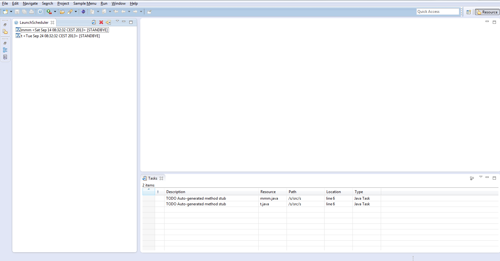
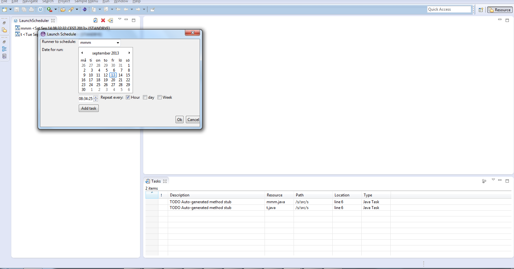

 Eclipse Launch Scheduler plugin
====================
What is Launch Schedule
---------------------
This plugin will give you the ability to schedule your launches in eclipse. 
Eclipse Launch Scheduler Is a plugin in eclipse that lets you schedule your launches with the help of a nice eclipse view.
It's basically a cron feature for eclipse. I moved the project to Github instead of sourceforge because it's simpler and better.
 
How to install :
---------------------
Use the update site: launchschedule.s3-website-us-east-1.amazonaws.com
 or
Copy the LaunchScheduler.jar from upload dir to your [ECLIPSE HOME DIR]/plugins

Start Launch Scheduler: Select Window->Show view->Other And then select Launch Scheduler

Version:
---------------------

* 2013-09-13 2.0 Fix alot of bugs added checkbox for hourly,dayly  and weekly launches. Moved the project over to github. 

* 2008-07-19 1.0 First version on sourceforge  

Project web sites :
---------------------
http://github.com/eclipselaunchsc/
Old project web site:
sourceforge.net/projects/eclipselaunchsc/

Screenshot
----------

 

	
